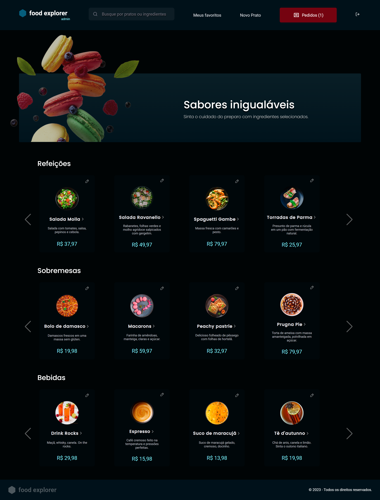
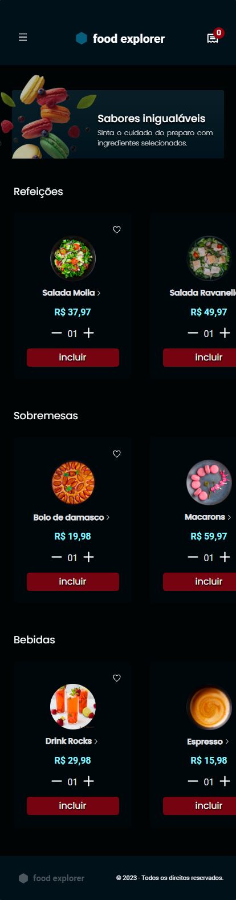

<h1 align="center" style="text-align: center;">
  
  Food Explorer
</h1>

<p align="center">
  <a href="#project">Sobre o Projeto</a>&nbsp;&nbsp;|&nbsp;&nbsp;
  <a href="#features">Funcionalidades</a>&nbsp;&nbsp;|&nbsp;&nbsp;
  <a href="#technologies">Tecnologias</a>&nbsp;&nbsp;|&nbsp;&nbsp;
  <a href="#look">Visualize a aplicação</a>&nbsp;&nbsp;|&nbsp;&nbsp;
  <a href="#license">Licença</a>
</p>

<h2 id="project">🎯Sobre o Projeto</h2>

| Desafio final do programa Explorer da Rocketseat |
- A aplicação é um cardápio digital para um restaurante fictício, conhecido como Food Explorer.
- Consiste na visualização de um prato até o pagamento do mesmo, bem como a versão mobile do projeto.
- Possui duas personas: o admin e o usuário;
- O admin é a pessoa responsável pelo restaurante, podendo criar, visualizar, editar e apagar um prato a qualquer momento.
- Cada prato contém uma imagem, um nome, uma categoria, uma breve descrição, os ingredientes e o seu preço. 
- Ao clicar em adicionar prato, o admin recebe uma mensagem de sucesso e é redirecionado para a página principal.
- O usuário visualiza todos os pratos cadastrados e, quando clica em um prato, é redirecionado para uma nova tela com informações mais detalhadas sobre ele.

 

<h2 id="features">🛠️ Funcionalidades</h2>

- Cadastrar usuários
- Login / Logout
- Cadastrar pratos
- Mostrar pratos cadastrados
- Filtrar pratos
- Mostrar detalhes do prato
- Editar prato
- Excluir prato 
- Favoritar prato
- Mostrar pratos favoritados
- Remover prato dos favoritos
- Adicionar pratos ao carrinho
- Realizar pedido
- Visualizar e controlar status de cada pedido

<h2 id="technologies">🖥️ Tecnologias</h2>

- Axios
- ReactJS
- ReactDOM
- React Icons
- React Router Dom
- Styled Components
- Swiper
- ViteJS

<h2 id="look">👩🏻‍💻 Visualize a aplicação no ar </h2>

✨ Clique [AQUI](https://foodexpplorer.netlify.app/) para acessar o projeto

⚠️ **Importante**: Este projeto utiliza uma hospedagem gratuita para o back-end, podendo ocorrer atrasos no tempo de resposta do servidor.

O Food Explorer possui duas personas principais: o admin e o usuário. 

Você pode criar um novo usuário ou testar a aplicação que já tem um histórico de pedidos e favoritos:
``````
Usuário:

- E-mail: user@email.com
- Senha: 123456
``````
O admin pode gerenciar o cardápio, adicionando, editando e removendo pratos, além visualizar e mudar o status dos pedidos.

```
Admin:

- E-mail: admin@email.com
- Senha: 123456
```

<h2 id="license">📝 Licença</h2>

Este projeto está sob a licença MIT.


## 👩‍💻 Author
Made with 💜 by Aline
<table align="left">
    <tr align="left">
        <td>
            <a href="https://github.com/alineviana">
                
                <p>👩🏽‍💻 Aline Viana</p> 
            </a>
        </td>
    </tr> 
</table>